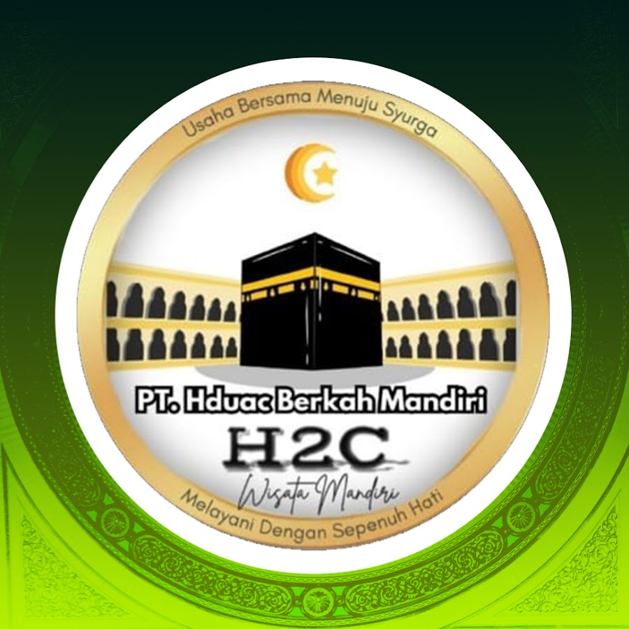

# DESIGN.md — H2C Wisata Mandiri Design System
**Version:** 1.0.0  
**Legal Entity:** PT. HDUAC Berkah Mandiri (PPIU Kemenag RI No. 26032300175410003, Akreditasi A)  
**Philosophy:** Luxury Hospitality & Spiritual Elegance (Sintesis Starbucks + Airbnb + Apple)  
**Target:** Web Landing Page H2C Wisata Mandiri (`/home/ubuntu/h2c-landing`)

---

## 1. Filosofi & Karakter Desain

Desain landing page H2C Wisata Mandiri dibangun di atas konvergensi 3 sistem desain kelas dunia yang disesuaikan dengan sakralitas ibadah Umroh dan Haji:

| Sumber Inspirasi | Elemen yang Diadopsi | Manifestasi pada H2C Wisata Mandiri |
| :--- | :--- | :--- |
| **Starbucks Design System** | Sistem fungsional 4-tier green, warm canvas cream, full-pill geometry (`rounded-full`) | Nuansa teduh Raudhah/Masjid Nabawi, CTA full-pill bersahabat, fondasi warna hijau bertingkat dari *Sanctuary* hingga *Mint Wash*. |
| **Airbnb Travel System** | Rasio kartu travel jernih, metadata perjalanan terstruktur, rounded geometry (`rounded-2xl`), visual hotel & maskapai terpercaya | Kartu paket umroh berorientasi eksplorasi visual, hotel distance chips, kepastian maskapai penerbangan, pembagian kuota kursi. |
| **Apple Typographic Minimalism** | Tipografi editorial serif dipadu geometric sans, negative letter-spacing (`tracking-tight`), ruang napas lapang, zero visual clutter | Headline editorial berwibawa, ketenangan ruang baca tanpa banner berkedip, hierarki harga transparan dan meyakinkan. |

### Prinsip Utama:
1. **Sacred Serenity (Ketenangan Ibadah):** Tidak ada elemen visual agresif. Warna hijau sanctuary dipadukan dengan kanvas porselen hangat menciptakan rasa aman, damai, dan khusyuk.
2. **High-Trust Assurance (Kepastian PPIU Kemenag):** Penempatan legalitas PT. HDUAC Berkah Mandiri, nomor SK PPIU, dan rekening resmi BSI terintegrasi natural sebagai bukti amanah.
3. **Radical Transparency (Keterbukaan Fasilitas):** Jarak hotel, nama maskapai, rincian biaya DP, dan tanggal keberangkatan disajikan gamblang tanpa jebakan teks halus (*fine print*).

---

## 2. Palet Warna & Token Semantik

### 2.1 Primary Palette (Sanctuary Greens)
Mewakili keagungan kubah hijau Masjid Nabawi, kesegaran spiritual, dan identitas resmi H2C.

| Token Name | Hex Code | Tailwind Arbitrary Class | Penggunaan Semantik |
| :--- | :--- | :--- | :--- |
| **Deep Sanctuary Emerald** | `#062319` | `bg-[#062319]`, `text-[#062319]` | Latar belakang hero, footer, teks headline kontras tinggi, border aksen gelap |
| **House Forest Green** | `#0d3827` | `bg-[#0d3827]`, `text-[#0d3827]` | Kartu kontainer gelap, header bar, elemen identitas primer |
| **Luminous Accent Green** | `#105e3f` | `bg-[#105e3f]`, `text-[#105e3f]` | Tombol CTA primer, link aktif, status sukses, hover state |
| **Mint Wash** | `#e1efe9` | `bg-[#e1efe9]`, `text-[#0d3827]` | Background pill badge, header tabel jadwal, highlight box halus |

### 2.2 Accent Palette (Sacred Gold & Champagne)
Memberikan aksen kemewahan bersahaja (*understated luxury*), terinspirasi dari ornamen kiswah dan arsitektur Haramain.

| Token Name | Hex Code | Tailwind Arbitrary Class | Penggunaan Semantik |
| :--- | :--- | :--- | :--- |
| **Warm Champagne Gold** | `#c5a059` | `text-[#c5a059]`, `bg-[#c5a059]` | Icon rating bintang, badge VIP/Akbar, highlight teks kunci |
| **Soft Gold Cream** | `#faf6ee` | `bg-[#faf6ee]` | Latar belakang kontainer emas muda, kartu promo khusus |
| **Gold Border** | `#dfc49d` | `border-[#dfc49d]` | Border kartu premium, aksen garis pembatas ornamen |

### 2.3 Canvas & Surface Neutrals
Menghindari warna putih murni (#FFFFFF) yang menyilaukan mata pada latar belakang besar; menggunakan warm porcelain untuk keteduhan membaca.

| Token Name | Hex Code | Tailwind Arbitrary Class | Penggunaan Semantik |
| :--- | :--- | :--- | :--- |
| **Warm Canvas Porcelain** | `#fcfbf9` | `bg-[#fcfbf9]` | Latar belakang utama seluruh halaman (*default canvas*) |
| **Warm Cream** | `#f4f1ea` | `bg-[#f4f1ea]` | Latar belakang seksi selang-seling (Trust Bento, FAQ, Tabel) |
| **Crisp Card White** | `#ffffff` | `bg-white` | Permukaan kartu paket, popover, formulir kontak |
| **Pure Dark Hero** | `#051c14` | `bg-[#051c14]` | Latar belakang hero banner malam hari & backdrop visual Ka'bah |

### 2.4 Functional & Text Neutrals

| Token Name | Hex Code | Tailwind Arbitrary Class | Penggunaan Semantik |
| :--- | :--- | :--- | :--- |
| **Charcoal Primary Text** | `#24312b` | `text-[#24312b]` | Teks tubuh utama (*body text*), deskripsi paragraf |
| **Muted Sage Slate** | `#5c7065` | `text-[#5c7065]` | Subtitle, metadata paket, tanggal, label fasilitas |
| **Hairline Border** | `#e6e4dc` | `border-[#e6e4dc]` | Garis pemisah (*divider*), border kartu netral |
| **Status Seat Terbatas** | `#b45309` / `#fef3c7` | `text-amber-800 bg-amber-100` | Badge sisa kursi tinggal sedikit |
| **Status Segera Berangkat**| `#991b1b` / `#fee2e2` | `text-red-800 bg-red-100` | Badge kloter terdekat |
| **Status Pendaftaran Buka**| `#065f46` / `#d1fae5` | `text-emerald-800 bg-emerald-100`| Badge jadwal kursi tersedia |

---

## 3. Sistem Tipografi & Skala Hirarki

### 3.1 Font Pairing
- **Heading & Editorial Font:** `Cormorant Garamond` (alternatif: `Playfair Display`, `serif`). Digunakan untuk judul hero H1, judul seksi H2, dan quote spiritual. Menghadirkan wibawa, sentuhan sastra, dan nuansa klasik Tanah Suci.
- **Body & Interface Font:** `Plus Jakarta Sans` (fallback: `Inter`, `system-ui`, `sans-serif`). Digunakan untuk navigasi, deskripsi paragraf, tabel jadwal, badge, dan angka harga. Memberikan kejelasan optimal pada perangkat seluler.

### 3.2 Skala Tipografi & Token Tailwind

| Elemen | Skala Font | Weight | Tracking & Leading | Kelas Tailwind |
| :--- | :--- | :--- | :--- | :--- |
| **Hero Display H1** | 48px – 72px | Medium (500) | `tracking-tight leading-[1.1]` | `font-serif text-4xl md:text-6xl lg:text-7xl font-medium tracking-tight leading-[1.1]` |
| **Section Title H2** | 32px – 48px | Medium (500) | `tracking-tight leading-tight` | `font-serif text-3xl md:text-5xl font-medium tracking-tight text-[#062319]` |
| **Card / Subtitle H3** | 20px – 24px | SemiBold (600) | `tracking-normal leading-snug` | `font-sans text-xl md:text-2xl font-semibold text-[#0d3827]` |
| **Section Eyebrow** | 12px – 13px | Bold (700) | `tracking-widest uppercase` | `font-sans text-xs uppercase tracking-widest text-[#c5a059] font-bold` |
| **Body Large (Lead)** | 18px – 20px | Normal (400) | `leading-relaxed` | `font-sans text-lg md:text-xl text-[#24312b] font-normal leading-relaxed` |
| **Body Regular** | 15px – 16px | Normal (400) | `leading-relaxed` | `font-sans text-base text-[#24312b] leading-relaxed` |
| **Caption & Meta** | 13px – 14px | Medium (500) | `tracking-normal` | `font-sans text-sm text-[#5c7065]` |
| **Price Hero Number** | 28px – 36px | Bold (700) | `tracking-tight` | `font-sans text-2xl md:text-3xl font-bold tracking-tight text-[#062319]` |

---

## 4. Geometri, Radius & Elevasi

### 4.1 Sudut Lengkung (Border Radii)
- **Full-Pill Geometry (50px / `rounded-full`):** Seluruh tombol Call-to-Action utama, badge promo, tag kategori, dan input pill menggunakan radius penuh ala Starbucks. Mengurangi ketegangan visual dan mempermudah tap di layar sentuh.
- **Card Geometry (16px – 20px / `rounded-2xl`):** Kartu paket, kartu video testimoni, dan kartu fasilitas menggunakan radius melengkung lembut ala Airbnb.
- **Bento & Feature Container (24px / `rounded-3xl`):** Kontainer besar pada seksi Trust Bento dan Banner Rekening Resmi menggunakan radius lapang.

### 4.2 Sistem Elevasi & Bayangan (Whisper-Soft Shadows)
Menghindari drop-shadow hitam tebal standar browser (`rgba(0,0,0,0.25)`). Menggunakan bayangan dengan rona hijau sanctuary organik beropasitas sangat rendah (4% hingga 10%):

```css
/* Token Shadow H2C */
--shadow-ambient: 0 4px 20px -4px rgba(6, 35, 25, 0.05);
--shadow-card: 0 10px 30px -6px rgba(6, 35, 25, 0.08);
--shadow-hover: 0 20px 40px -10px rgba(6, 35, 25, 0.12);
--shadow-modal: 0 25px 50px -12px rgba(6, 35, 25, 0.20);
```

**Tailwind Mapping:**
- Ambient: `shadow-[0_4px_20px_-4px_rgba(6,35,25,0.05)]`
- Card: `shadow-[0_10px_30px_-6px_rgba(6,35,25,0.08)]`
- Hover Card: `hover:shadow-[0_20px_40px_-10px_rgba(6,35,25,0.12)] hover:-translate-y-1 transition-all duration-300 ease-out`

---

## 5. Blueprint Spesifikasi Komponen

### 5.1 Header & Navigasi
- **Struktur:** Sticky header dengan efek frosted glass Apple (`backdrop-blur-md bg-white/85 border-b border-[#e6e4dc]/75`).
- **Logo Lockup:** Logo resmi H2C Wisata Mandiri dengan badge PPIU Kemenag di sebelahnya:
  ```html
  <header class="sticky top-0 z-50 w-full backdrop-blur-md bg-white/85 border-b border-[#e6e4dc]/75 transition-all">
    <div class="max-w-7xl mx-auto px-4 sm:px-6 lg:px-8 h-20 flex items-center justify-between">
      <a href="#" class="flex items-center gap-3">
        
        <div class="hidden sm:block border-l border-[#e6e4dc] pl-3">
          <span class="block text-[11px] uppercase tracking-wider font-semibold text-[#0d3827]">PPIU Kemenag RI</span>
          <span class="block text-[10px] text-[#5c7065] font-mono">No. 26032300175410003</span>
        </div>
      </a>
      <nav class="hidden md:flex items-center gap-8 text-sm font-medium text-[#24312b]">
        <a href="#paket" class="hover:text-[#105e3f] transition-colors">Paket Umroh</a>
        <a href="#jadwal" class="hover:text-[#105e3f] transition-colors">Jadwal Keberangkatan</a>
        <a href="#keunggulan" class="hover:text-[#105e3f] transition-colors">Keunggulan 5 Pasti</a>
        <a href="#galeri" class="hover:text-[#105e3f] transition-colors">Dokumentasi</a>
        <a href="#faq" class="hover:text-[#105e3f] transition-colors">Tanya Jawab</a>
      </nav>
      <div class="flex items-center gap-3">
        <a href="https://wa.me/6281316333001?text=Bismillah,%20saya%20ingin%20konsultasi%20paket%20umroh%20H2C" 
           class="inline-flex items-center gap-2 bg-[#105e3f] hover:bg-[#0d3827] text-white text-sm font-semibold px-6 py-3 rounded-full shadow-[0_4px_16px_rgba(16,94,63,0.25)] hover:shadow-none transition-all duration-200">
          <svg class="w-4 h-4 fill-current" viewBox="0 0 24 24"><!-- WhatsApp Icon --></svg>
          <span>Konsultasi Gratis</span>
        </a>
      </div>
    </div>
  </header>
  ```

### 5.2 Hero Banner (Sacred Editorial)
- **Visual:** Backdrop atmosfer malam Masjidil Haram / Ka'bah dengan gradien vertikal tenang ke `#051c14`.
- **Komponen Kunci:**
  1. Eyebrow badge bersinar lembut: `bg-[#faf6ee]/10 text-[#c5a059] border border-[#c5a059]/30 rounded-full px-4 py-1.5`.
  2. Headline editorial dua baris: *"Niat ke Baitullah, Kami Siapkan Jalannya."*
  3. Lead text yang menenangkan: Menegaskan kepastian izin PPIU Kemenag dan bimbingan sunnah.
  4. Dual Full-Pill CTA: Tombol utama emas/emerald + Tombol sekunder ghost pill (*"Lihat Jadwal & Estimasi Biaya"*).
  5. Baris Trust Metric 3 pilar: Legalitas PPIU Resmi, Akreditasi A, dan Kepastian Hotel Bintang 4/5.

### 5.3 Trust Bento & 5 Pasti Umroh Kemenag
- **Konsep:** Bento grid asimetris yang membuktikan komitmen legalitas tanpa membuat pengunjung merasa diintimidasi dokumen hukum:
  - **Tile 1 (Legalitas & SK PPIU):** Sertifikat Kemenag RI, nomor izin usaha, dan akreditasi A.
  - **Tile 2 (Kepastian Maskapai PP):** Saudia Airlines / Garuda Indonesia / Turkish Airlines langsung tanpa transit membingungkan.
  - **Tile 3 (Hotel Dekat Pelataran):** Maysan Al Maqam / Mirage Salam (<350 meter dari Masjid).
  - **Tile 4 (Bimbingan Sesuai Sunnah):** Muthowif mukim bersertifikat dan berilmu.
  - **Tile 5 (Rekening Bank Resmi Penyelenggara):** Rekening Bank Syariah Indonesia (BSI) atas nama PT. HDUAC Berkah Mandiri untuk melindungi jamaah dari penipuan rekening pribadi.

### 5.4 Kartu Paket Umroh (Airbnb Geometry + Starbucks Clarity)
- **Spesifikasi Kartu:**
  - Container: `bg-white rounded-2xl border border-[#e6e4dc] overflow-hidden shadow-[0_10px_30px_-6px_rgba(6,35,25,0.06)] hover:shadow-[0_20px_40px_-10px_rgba(6,35,25,0.12)] transition-all duration-300`
  - Gambar Header: Rasio `16:10` dengan badge status di sudut kiri atas:
    - Pilihan Utama: `bg-[#062319] text-[#faf6ee]`
    - Paling Diminati: `bg-[#faf6ee] text-[#c5a059] border border-[#dfc49d]`
  - Baris Info Maskapai & Durasi: Chip ikonik dengan teks sans-serif teratur.
  - Hierarki Harga Transparan:
    - Harga coret (sebelum diskon): `text-sm text-stone-400 line-through font-normal`
    - Harga promo aktual: `text-3xl font-bold font-sans text-[#062319]`
    - Label DP bersahabat: `text-xs font-semibold text-[#105e3f] bg-[#e1efe9] px-2.5 py-1 rounded-full inline-block mt-1`
  - Fasilitas Hotel: Ikon hotel bintang, nama hotel Makkah & Madinah dengan estimasi jarak ke masjid.
  - Tombol Pesan Kursi: Full-pill button dengan warna hijau interaktif `#105e3f`.

### 5.5 Tabel Jadwal Interaktif (Musim 2026 - 2027)
- **Tujuan:** Memberikan kemudahan bagi calon jamaah memilih tanggal keberangkatan tanpa harus download brosur PDF berat.
- **Filter Tabs:** Full-pill toggle: `Semua Keberangkatan`, `Tahun 2026`, `Tahun 2027`.
- **Kolom Tabel:**
  1. Program & Waktu Keberangkatan (Bulan & Tahun)
  2. Durasi Hari (9 Hari / 12 Hari / 16 Hari)
  3. Maskapai Penerbangan (Logo + Nama Maskapai)
  4. Hotel Makkah & Madinah
  5. Biaya Paket
  6. Status Ketersediaan Seat (Pill Badge: *Sisa 12 Seat*, *Ready Seat*, *Promo Awal Musim*)
  7. Aksi Konsultasi Cepat (Direct WhatsApp trigger dengan pre-filled text nama paket)

### 5.6 Showcase Video & Dokumentasi Lapangan
- Format grid video 16:9 yang menampilkan realitas perjalanan jamaah H2C:
  - Bimbingan Manasik di Hotel Bintang
  - Manasik & Fasilitas Executive Lounge Bandara Soekarno-Hatta
  - Kenyamanan Kereta Cepat Haramain Makkah-Madinah
  - Ziarah Raudhah & Masjidil Haram didampingi Muthowif
  - Pengalaman Nyata Jamaah (Testimoni Tanpa Rekayasa)

### 5.7 Muthowif & Tim Pelayanan
- Menampilkan profil asatidz pembimbing bersertifikat dengan foto rapi, latar natural, gelar, serta rekam jejak bimbingan sunnah yang shahih.

### 5.8 FAQ Accordion (Kejelasan Tanpa Keraguan)
- Menggunakan accordion bordered minimalis (`border-b border-[#e6e4dc] py-4`):
  - Pertanyaan 1: Apakah H2C Wisata Mandiri memiliki izin resmi Kemenag?
  - Pertanyaan 2: Berapa DP minimal untuk mengunci seat paket?
  - Pertanyaan 3: Bagaimana jika jamaah mendadak berhalangan berangkat? (Kebijakan Refund Transparan)
  - Pertanyaan 4: Apakah jamaah lansia atau berkursi roda mendapatkan pendampingan khusus?
  - Pertanyaan 5: Apakah ada biaya tersembunyi selain harga paket?

### 5.9 Footer (Sacred Grounding & Akuntabilitas Hukum)
- **Background:** `bg-[#062319] text-[#e1efe9] border-t border-[#0d3827]`
- **Unsur Wajib:**
  1. Identitas PT resmi: **PT. HDUAC Berkah Mandiri**
  2. Nomor PPIU Kemenag RI: **26032300175410003**
  3. Himbauan Anti-Penipuan: Penegasan pembayaran hanya sah bila ditransfer ke rekening resmi perusahaan di **Bank Syariah Indonesia (BSI) No. Rekening a.n. PT HDUAC Berkah Mandiri**.
  4. Alamat Kantor Fisik & Google Maps Pin: Ruko Telaga Pesona Blok L3 No. 3 & 5, Cikarang Barat, Kab. Bekasi.
  5. Tautan Kebijakan: Syarat & Ketentuan, Kebijakan Privasi, Kebijakan Pengembalian Dana (Refund).

---

## 6. Aturan Anti-Gimmick (Anti-Cheap Tactics)

Sebagai biro perjalanan ibadah bernilai spiritual tinggi, antarmuka landing page H2C **secara ketat dilarang** menerapkan trik psikologis murahan (*dark patterns*):

| Praktik Terlarang | Alasan Pelarangan | Solusi Beretika H2C |
| :--- | :--- | :--- |
| **Fake Countdown Timer** (cth: "Sisa 02:45 menit sebelum promo hangus!") | Tidak jujur secara syar'i dan merusak kredibilitas legalitas PPIU. | Tampilkan bulan keberangkatan riil dan tanggal penutupan pendaftaran visa. |
| **Fake Notification Toasts** (cth: *"Bapak Budi dari Solo baru saja memesan 2 seat"* yang digenerate script acak) | Memanipulasi bukti sosial palsu (*false social proof*). | Tampilkan foto & video dokumentasi jamaah asli di Tanah Suci dan nomor SK PPIU. |
| **Autoplay Audio/Video dengan Suara Mengagetkan** | Mengganggu kenyamanan membaca calon jamaah. | Seluruh video default `muted` dengan opsi klik putar jelas. |
| **Tombol WhatsApp Mengambang Menutupi Konten** | Mengganggu akses navigasi di layar smartphone. | FAB WhatsApp diletakkan rapi di sudut kanan bawah dengan ukuran proporsional (54px), tidak menutupi teks CTA kartu. |
| **Animasi Berlebihan (Bouncing, Blinking, Strobe)** | Mengaburkan ketenangan ibadah dan memperlambat rendering web. | Transisi halus durasi pendek (`duration-200 ease-out`) untuk feedback klik dan scroll. |

---

## 7. Tailwind Configuration Code

Berikut konfigurasi ekstensi warna dan font untuk diterapkan pada `tailwind.config.js` atau inline CSS config:

```javascript
/** @type {import('tailwindcss').Config} */
module.exports = {
  theme: {
    extend: {
      colors: {
        h2c: {
          // Primary Greens
          emerald: '#062319',
          forest: '#0d3827',
          luminous: '#105e3f',
          mint: '#e1efe9',
          
          // Sacred Gold Accents
          gold: '#c5a059',
          goldcream: '#faf6ee',
          goldborder: '#dfc49d',
          
          // Surfaces & Canvas
          canvas: '#fcfbf9',
          cream: '#f4f1ea',
          dark: '#051c14',
          
          // Text Neutrals
          charcoal: '#24312b',
          sage: '#5c7065',
          hairline: '#e6e4dc',
        }
      },
      fontFamily: {
        serif: ['Cormorant Garamond', 'Playfair Display', 'Georgia', 'serif'],
        sans: ['Plus Jakarta Sans', 'Inter', 'system-ui', 'sans-serif'],
      },
      borderRadius: {
        'pill': '9999px',
        '2xl': '18px',
        '3xl': '24px',
      },
      boxShadow: {
        'h2c-ambient': '0 4px 20px -4px rgba(6, 35, 25, 0.05)',
        'h2c-card': '0 10px 30px -6px rgba(6, 35, 25, 0.08)',
        'h2c-hover': '0 20px 40px -10px rgba(6, 35, 25, 0.12)',
      }
    }
  }
}
```

---

## 8. Verifikasi & Checklist Kualitas Desain

- [x] Sintesis 3 pilar terpenuhi: Starbucks (hijau fungsional + kanvas hangat + pill), Airbnb (geometri kartu perjalanan + metadata), Apple (tipografi headline editorial + negative letter-spacing).
- [x] Seluruh token warna spesifik (Emerald `#062319`, Forest `#0d3827`, Luminous `#105e3f`, Gold `#c5a059`, Canvas `#fcfbf9`, Dark `#051c14`) terdefinisi gamblang dengan kelas Tailwind.
- [x] Legalitas resmi PT. HDUAC Berkah Mandiri & PPIU Kemenag No. 26032300175410003 masuk ke blueprint komponen.
- [x] Tidak ada komponen gimmick (countdown palsu, toast semu, slider tak berguna).
- [x] Struktur responsif ramah seluler (*mobile-first*) dengan tap target minimal 44x44px.
